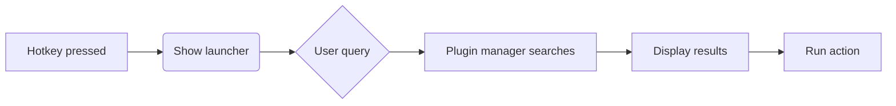
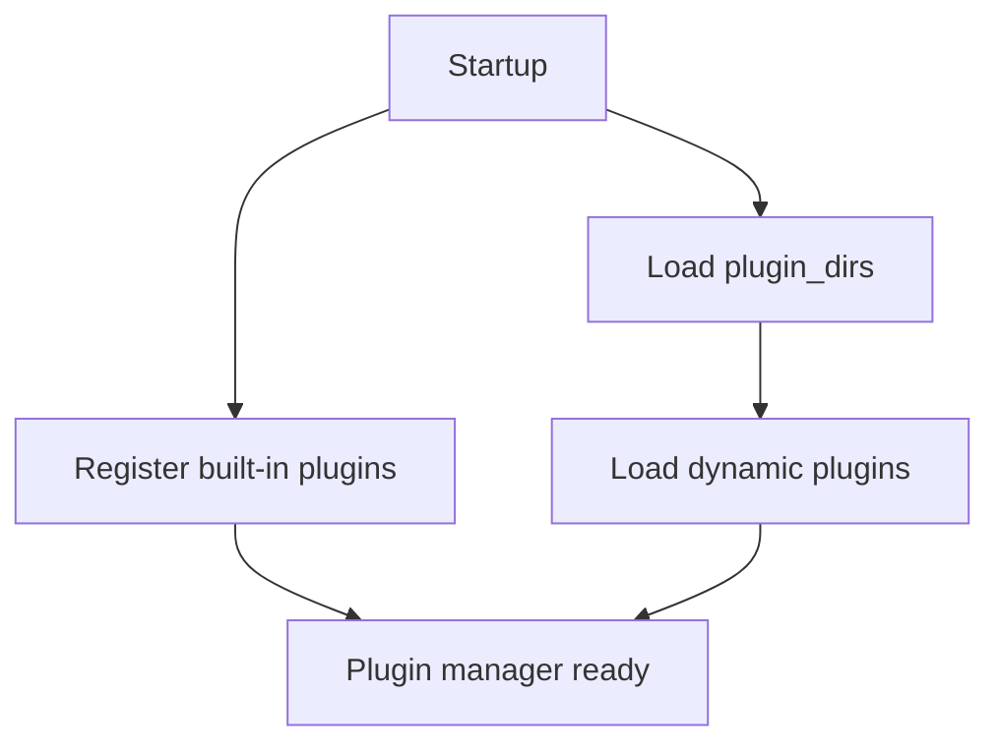
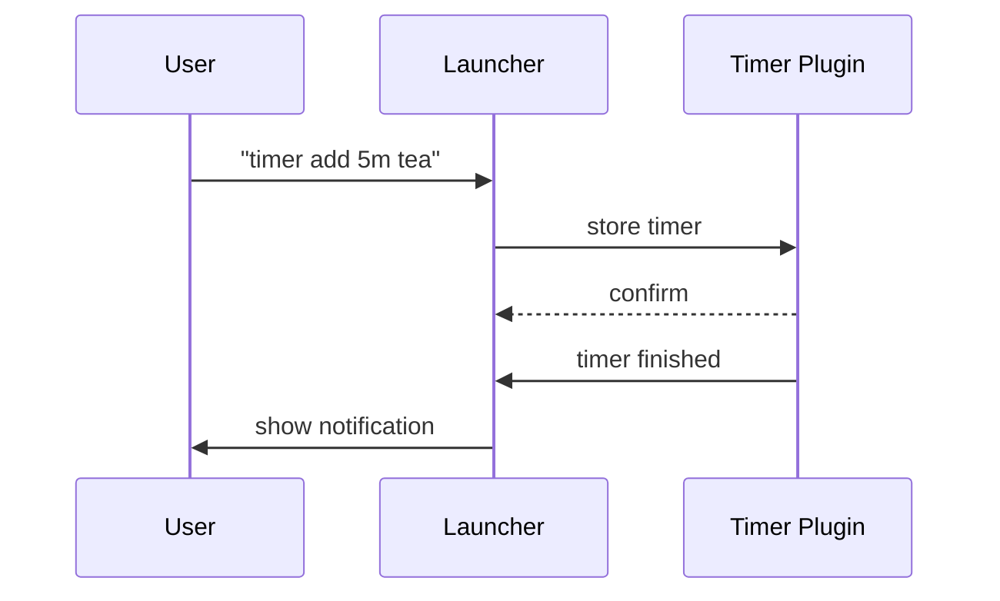
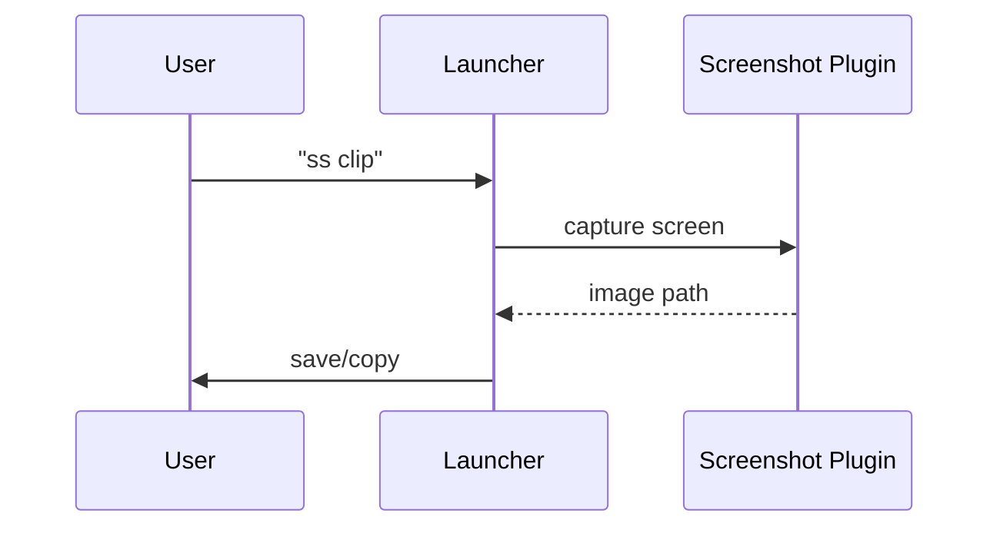

# Multi Launcher


Multi Launcher is a lightweight application launcher for Windows built with Rust
and `eframe`. The project targets Windows exclusively. It supports configurable
hotkeys, basic plugin architecture and file indexing to quickly open
applications or files.


## Use Cases

- Launch installed applications or custom commands from anywhere using a single hotkey.
- Search your clipboard history or saved bookmarks to quickly paste or open items.
- Run shell commands without opening a terminal.
- Perform web searches or look up documentation directly.
- Jump to frequently used folders with the folders plugin.
- Set timers or alarms from the launcher. Type `timer` or `alarm` and press
  <kbd>Enter</kbd> to open the creation dialog.
- Keep track of quick todo items or notes.
- Insert saved text snippets, add new ones with `cs add <alias> <text>` or edit them with `cs edit`.
- Monitor network traffic with the `net` command.
- Control media playback using the `media` prefix.
- Trigger sequences of commands through the `macro` plugin.
- Capture screenshots to a file or the clipboard.
- Switch between open browser tabs.
- Check local and public IP addresses.
- Generate random numbers, dice rolls or passwords.
- Create lorem ipsum filler text or search for emoji.
- Convert text between cases like `snake_case` or `camelCase`.
- Pick colors and copy them as hex, RGB or HSL values.
- Track time with a built-in stopwatch or open the Windows Task Manager.


## Building

Requirements:
- Rust toolchain

```
cargo build --release
```

To capture `CapsLock` reliably and suppress its normal toggle, build with the
optional `unstable_grab` feature. Without this feature some systems may ignore
the `CapsLock` hotkey:

```
cargo build --release --features unstable_grab
```

This feature is defined in `Cargo.toml` and enables the underlying `rdev`
capability used to grab keyboard events.

For debugging, enable **Debug logging** in the settings window. When this
option is active, you can further adjust the verbosity by setting the
`RUST_LOG` environment variable before running the program:

```powershell
$env:RUST_LOG="info"; cargo run --release --features unstable_grab
```

Enable persistent log files by adding a `log_file` entry to `settings.json`.
Set it to `true` to create `launcher.log` next to the executable or supply a
custom path.

If hotkeys do nothing, check the output for warnings starting with
`Hotkey listener failed`. When using `CapsLock` as the hotkey you almost
always need to build with `--features unstable_grab` so the listener can
grab the key.

## Settings

Multi Launcher automatically creates a `settings.json` file next to the binary
on first run. Edit this file or open the **Settings** window to customise the
launcher. The default hotkey is `F2`. To use a different key, set the `hotkey`
value as shown below:

```json
{
  "hotkey": "F2",
  "quit_hotkey": "Shift+Escape",
  "help_hotkey": "F1",
  "enabled_plugins": [
    "web_search",
    "calculator",
    "unit_convert",
    "clipboard",
    "bookmarks",
    "folders",
    "shell",
    "runescape_search",
    "weather",
    "system",
    "timer",
    "macros",
    "history",
    "help"
  ],
  "enabled_capabilities": {"folders": ["search", "show_full_path"]},
  "note_save_on_close": false,
  "enable_toasts": true,
  "fuzzy_weight": 1.0,
  "usage_weight": 1.0,
  "debug_logging": false,
  "developer_debug": false,
  "log_file": true,
  "offscreen_pos": [2000, 2000],
  "window_size": [400, 220],
  "query_scale": 1.0,
  "list_scale": 1.0,
  "history_limit": 100,
  "clipboard_limit": 20,
  "preserve_command": false,
  "clear_query_after_run": false,
  "follow_mouse": true,
  "static_location_enabled": false,
  "static_pos": [0, 0],
  "static_size": [400, 220],
  "screenshot_dir": "./MultiLauncher_Screenshots",
  "screenshot_save_file": true
}
```

The `hotkey` value accepts a base key with optional modifiers separated by `+`.
Examples include `"Ctrl+Shift+Space"` or `"Alt+F1"`. Supported modifiers are
`Ctrl`, `Shift` and `Alt`. Valid keys cover alphanumeric characters, function
keys (`F1`-`F12`) and common keys like `Space`, `Tab`, `Return`, `Escape`,
`Delete`, arrow keys and `CapsLock`.

`quit_hotkey` can be set to another key combination to close the launcher from
anywhere. If omitted, the application only quits when the window is closed
through the GUI.
`help_hotkey` toggles a quick overlay listing commands. Set it to `null` or
uncheck the *Enable help hotkey* box in the Settings window to disable this
shortcut.

`offscreen_pos` specifies where the window is moved when hiding it. Choose
coordinates outside the visible monitor area so the window stays accessible but
off-screen. The default is `[2000, 2000]`.

`window_size` stores the size of the launcher window when it was last closed.
The window is restored to this size on the next start. The default is
`[400, 220]` if the value is missing.

When `follow_mouse` is `true` the window is centered on the mouse cursor
whenever it becomes visible. To keep the launcher at a specific
position instead, set `follow_mouse` to `false` and enable
`static_location_enabled`. Provide the desired coordinates in `static_pos`
and optionally a fixed size via `static_size`. The **Settings** window now
includes a *Snapshot* button to capture the current window position and size
for these fields.

`query_scale` and `list_scale` control the size of the search field and the results list separately. Values around `1.0` keep the default look while higher numbers enlarge the respective element up to five times.
`enable_toasts` controls short pop-up notifications when saving settings or commands. Set it to `false` to disable these messages.
`note_save_on_close` automatically saves the contents of note panels whenever the window closes—whether you press `Esc`, click the close button, or trigger another close event. The default is `false`. Toggle this behaviour from the **Settings** window via the "Save note on close (Esc)" checkbox in the **Note** section.
`fuzzy_weight` and `usage_weight` adjust how results are ranked. The fuzzy weight multiplies the match score while the usage weight favours frequently launched actions. Setting `"fuzzy_weight": 0` in `settings.json` forces case-insensitive substring matching across all plugins.
Command aliases are checked first and a matching alias ranks above other results.

Example: typing `test` will only list entries containing `test`. If an alias matches this word it appears before the other results.
`history_limit` defines how many entries the history plugin keeps.
`clipboard_limit` sets how many clipboard entries are persisted for the clipboard plugin.
`preserve_command` keeps the typed command prefix (like `bm add` or `f add`) in the search field after running an action.
`clear_query_after_run` removes the search text after a successful action whenever you prefer starting with a blank box.
`enabled_capabilities` maps plugin names to capability identifiers so features can be toggled individually. The folders plugin, for example, exposes `show_full_path`.
`screenshot_dir` sets the directory used when saving screenshots. If omitted, screenshots are stored in a `MultiLauncher_Screenshots` folder in the current working directory.
`screenshot_save_file` determines whether screenshots copied to the clipboard are also written to disk. The default is `true`.


If you choose `CapsLock` as the hotkey, the launcher suppresses the normal
CapsLock toggle **when compiled with the `unstable_grab` feature enabled**.
Press `Shift`+`CapsLock` to change the keyboard state while the application is
running. The launcher only responds when `CapsLock` is pressed on its own; any
other modifier keys will simply toggle the caps lock state without showing the
window.

## Plugins





Built-in commands:

| Prefix | Example | Description |
|-------|---------|-------------|
| `g` | `g rust` | Google web search |
| `=` | `= 2+2` | Calculator |
| `conv` | `conv 10 km to mi` | Unit and base conversions |
| `drop` | `drop 1/128 128` | Drop rate calculator |
| `rs`/`osrs` | `rs item` | RuneScape Wiki search |
| `yt` | `yt rust` | YouTube search |
| `red` | `red cats` | Reddit search |
| `wiki` | `wiki rust` | Wikipedia search |
| `cb` | `cb list` | Clipboard history |
| `bm` | `bm add <url>` | Manage bookmarks |
| `f` | `f add <path>` | Folder shortcuts |
| `o` | `o list` | Omni search |
| `sys` | `sys shutdown` | System actions |
| `ps` | `ps` | Process list |
| `info` | `info cpu` | System information |
| `net` | `net` | Network usage |
| `ip` | `ip` | Show IP addresses |
| `sh` | `sh echo hi` | Shell commands |
| `hi` | `hi` | Search history |
| `note` | `note add <text>` or `note rm <slug>` | Quick notes |
| `todo` | `todo add <task>` | Todo items |
| `todo edit` | `todo edit` | Edit todos |
| `todo export` | `todo export` | Export todos |
| `cs` | `cs add <alias> <text>` | Text snippets |
| `macro` | `macro list` | Command macros |
| `rec` | `rec` | Recycle Bin cleanup |
| `tmp` | `tmp new [name]` or `tmp create [name]` | Temporary files |
| `ascii` | `ascii text` | ASCII art |
| `emoji` | `emoji smile` | Emoji search |
| `case` | `case hello world` | Text and encoding conversions |
| `color` | `color #ff0000` | Color picker and formats |
| `ts` | `ts 0` | Timestamp conversion |
| `tsm` | `tsm 3600000` | Midnight timestamp |
| `rand` | `rand number 10` | Random numbers, dice and passwords |
| `app` | `app <filter>` | Saved apps |
| `vol` | `vol 50` | Volume control (`vol pid <pid> <level>`; dialog lists processes on Windows) |
| `media` | `media play` | Media controls |
| `bright` | `bright 50` | Adjust brightness |
| `tm` | `tm` | Task Manager |
| `win` | `win <title>` | Window management |
| `ss` | `ss clip` | Screenshot capture |
| `help` | `help` | Command overview |
| `sw` | `sw start` | Stopwatch |
| `timer` | `timer add 5m tea` | Timers |
| `alarm` | `alarm 07:30` | Alarms |
| `weather` | `weather Berlin` | Weather lookup |

Timers and alarms are stored in `alarms.json` and reload automatically when the launcher starts. The timer plugin exposes a `completion_dialog` capability that toggles pop-up notifications when a timer completes.

Stopwatches use the `sw` prefix. Start one with `sw start`, stop it with `sw stop` or reset it via `sw reset`. Right click a stopwatch entry to copy the elapsed time. A precision option in the **Settings** window controls how many decimals are displayed.



### Conversion Plugins
The `conv`/`convert` prefix now covers two plugins:

- **Unit Convert** handles common units like length, mass, temperature, volume,
  area, speed, pressure, energy, power, data, time, fuel economy and angles.
  Examples:

  ```text
  conv 1 kwh to j
  conv 8 bit to byte
  conv 30 mpg to kpl
  conv 180 deg to rad
  ```

- **Base Convert** translates between binary, hexadecimal, octal, decimal and
  plain text:

  ```text
  conv 1010 bin to hex
  conv ff hex to bin
  conv "hello" text to hex
  conv 48656c6c6f hex to text
  conv 42 dec to bin
  ```

### Volume Plugin
Control system volume or specific processes:
```text
vol 75
vol pid 1234 50
vol name notepad.exe 20
```
On Windows, opening the volume dialog (`vol`) also lists running applications
with sliders to adjust each process just like the system volume mixer.

### Screenshot Plugin
Use `ss` to capture the active window, a custom region or the whole desktop. Add `clip` to copy the result to the clipboard.
Screenshots are saved in a `MultiLauncher_Screenshots` folder in the current working directory by default or the path set in `screenshot_dir`.
Set `screenshot_save_file` to `true` to always keep a file when copying to the clipboard.



### Text Case Plugin
Convert text to different cases. Example:

```text
case Hello World
```

The plugin shows many variations including uppercase, lowercase, capitalized,
camelCase, PascalCase, snake_case, SCREAMING_SNAKE_CASE, kebab-case,
Train-Case, dot.case and space case. It also offers alternating, mocking,
inverse and backwards cases, acronym and initial forms, sentence and title
case, Base64/hex/binary encodings, ROT13, clap and emoji text, custom
delimiters and Morse code. Select any variant to copy it to the clipboard.

### Macros Plugin
The macros plugin runs a saved sequence of launcher commands. Macros are stored in `macros.json` and can be edited by typing `macro` to open the editor.

```text
macro list
macro example
```

### Random Plugin
Generate random numbers, dice rolls or passwords with the `rand` prefix. Examples:

```text
rand number 10
rand dice
rand pw 8
```

### IP Plugin
Display local network interface addresses with the `ip` prefix. Append `public` to also retrieve the public IP via `api.ipify.org`.

### Color Picker Plugin
Type `color` to open an interactive picker or specify a hex value such as `color #ff0000`. The plugin outputs the selected color in multiple formats: `#RRGGBB`, `rgb(r, g, b)` and `hsl(h, s%, l%)`. Use the arrow keys to highlight a format and press <kbd>Enter</kbd> to copy it to the clipboard.

### Notes Plugin
Manage quick Markdown notes with the `note` prefix. The editor window includes an **Open externally** button to open the current note in another program. A setting under the Note plugin labelled *Open externally* chooses the default opener: **WezTerm**, **Powershell**, **Notepad** or **Neither** to be asked each time. **WezTerm** is supported and is the default external editor. The **Powershell** option uses PowerShell 7 when available (listed as "Powershell" in the menu) and falls back to `powershell.exe`.

When the search box is empty the launcher shows these shortcuts along with `app <alias>` entries for saved actions.

Selecting a clipboard entry copies it back to the clipboard. Type `help` and press <kbd>Enter</kbd> to open the command list. The help window groups commands by plugin name and can optionally display example queries. Additional plugins can be added by building
shared libraries. Each plugin crate should be compiled as a `cdylib` and export
a `create_plugin` function returning `Box<dyn Plugin>`:

```rust
#[no_mangle]
pub extern "C" fn create_plugin() -> Box<dyn Plugin> {
    Box::new(MyPlugin::default())
}
```

Place the resulting library file in one of the directories listed under
`plugin_dirs` in `settings.json`.

Plugins can be enabled or disabled from the **Settings** window. The list of
active plugins is stored in the `enabled_plugins` section of `settings.json`.
The **Plugin Settings** dialog enables or disables plugins and toggles
capabilities like `show_full_path`.

Changes take effect immediately once the dialog is closed. Use this window to
enable additional plugins as they become available. A plugin to expose
environment variables is planned for a future release.


Example:

```json
{
  "enabled_plugins": [
    "web_search",
    "calculator",
    "clipboard",
    "bookmarks",
    "folders",
    "shell",
    "runescape_search",
    "system",
    "processes",
    "network",
    "weather",
    "timer",
    "media",
    "macros",
    "history",
    "help"
  ]
}
```
The folders plugin recognises the `f` prefix. Use `f add <path>` to add a folder
shortcut and `f rm <pattern>` to remove one via fuzzy search. Custom entries can
be aliased by right clicking them in the results list. Hovering a folder result
shows its full path. A plugin setting "show full path always" controls whether
the full path is displayed next to an alias or only as a tooltip.
The bookmarks plugin uses the `bm` prefix. Use `bm add <url>` to save a link,
`bm rm` to list and remove bookmarks (optionally filtering with a pattern) or
`bm list` to show all bookmarks. Searching with `bm <term>` matches both URLs
and aliases.
The omni search plugin uses the `o` prefix to search folders, bookmarks and saved apps at once. Use `o list` to show all entries or `o list <query>` to filter them.
The system information plugin uses the `info` prefix. Type `info` to show CPU,
memory and disk usage or `info cpu` for a single metric.
Other handy prefixes include `ip` to show local and public addresses, `tab` to switch
browser tabs, `rand` for random numbers, dice rolls or passwords, and `lorem` for filler
text. Use `emoji` to search emoji or kaomoji, `case` to transform text casing,
`sw` for a stopwatch, `ss` to capture screenshots, `tm` to open the Windows
Task Manager and `settings` to bring up the settings dialog.
### Security Considerations
The shell plugin runs commands using the system shell without sanitising input. Only enable it if you trust the commands you type. Errors while spawning the process are logged.
Type `sh` in the launcher to open the shell command editor for managing predefined commands. Saved commands can also be added with `sh add <name> <command>`, removed via `sh rm <pattern>` or listed with `sh list`.
## Editing Apps
The launcher stores its custom actions in `actions.json` next to the
executable. This file is created automatically the first time you save an
app. While running the application you can manage this list through
**Edit Apps**. Open the launcher with the configured hotkey and choose
*Edit Apps* from the menu.
Use the **New App** button to open the *Add App* dialog where you enter
a label, description and the executable path. Enable **Add arguments** to supply
extra command line parameters. The **Browse** button lets you
select the file interactively. Existing entries can be edited via the **Edit**
button or by right clicking an app in the results list and choosing *Edit
App*. Apps can also be removed from the list. All changes are written to
`actions.json` immediately.

Type `app <filter>` in the launcher to search these saved entries. Typing `app`
alone lists all saved apps.

## Packaging

The project can be compiled for Windows using `cargo build --release`.
Afterwards bundle the binary for distribution using a Windows packaging tool
such as `cargo wix`.
When compiled this way the executable is built with `windows_subsystem = "windows"`, which prevents an extra console window from appearing.

## Troubleshooting

When diagnosing hotkey issues it can be helpful to enable info level logging:

```powershell
$env:RUST_LOG="info"; cargo run
```
## Tips

- Press the help hotkey (F1 by default) to display a quick list of available commands.
- Right click a folder result to set a custom alias for easier access.
- Right click a note entry to edit, remove, or open it in Neovim. The note editor's **Open externally** button uses the configured default opener.
- On Windows, Neovim launches via `Powershell` (PowerShell 7 when available), then `powershell.exe`, falling back to `cmd.exe`.
- Use the *Snapshot* button in Settings when adjusting static window placement.
- Searches are case-insensitive and also match on command aliases.
- Tweak `fuzzy_weight` and `usage_weight` if you want results to favour name matches or past usage differently.


## Manual Test Plan

1. Build and run the project with `cargo run`.
2. **Before** the launcher window appears, press the configured hotkey once.
3. Observe the log output. There should be a message indicating a visibility
   change was queued.
4. When the GUI finishes initialising, it should immediately apply the queued
   visibility change and the window becomes visible. A log entry confirms this.
5. Press the hotkey again to ensure normal toggling after start-up.

On Windows the launcher also checks which virtual desktop the window belongs to
whenever it becomes visible. If it is on another desktop it is automatically
moved to the active one before being shown.
